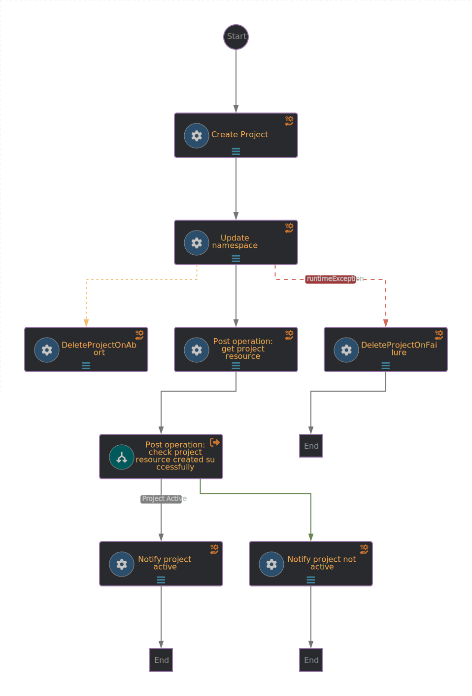

# Create OpenShift Project workflow
The workflow creates a new OpenShit project and set annotations and labels to it.

Then compute resources are applied, see https://docs.redhat.com/en/documentation/openshift_container_platform/4.16/html/scalability_and_performance/compute-resource-quotas#admin-quota-limits_using-quotas-and-limit-ranges 

## Workflow application configuration
Application properties can be initialized from environment variables before running the application:

| Environment variable  | Description | Mandatory | Default value |
|-----------------------|-------------|-----------|---------------|
| `BACKSTAGE_NOTIFICATIONS_URL`      | The backstage server URL for notifications | ✅ | |
| `NOTIFICATIONS_BEARER_TOKEN`      | The authorization bearer token to use to send notifications | ✅ | |
| `OCP_API_SERVER_URL`      | The OCP API server url | ✅ | |
| `OCP_API_SERVER_TOKEN`      | The authorization bearer token to use when sending request to OCP | ✅ | |


## Input
- `OCP project to create` [required] - the OCP project to be created on the OCP cluster.
- `Annotations` - the annotations to set in the project.
- `Labels`  - the labels to assign to the project.
- `Compute Resources` -  The `LimitRange` specification object
- `Recipients` - the recipients of the notifications, automatically populated thanks to the custom UI plugin.

## Workflow diagram


## Installation

Once the manifests are deployed, set the environements variables needed.

To obtain an OpenShift API token, create a Service Account, assign permissions to it, and request a token:

```bash
oc create sa orchestrator-ocp-api
oc adm policy add-cluster-role-to-user cluster-admin -z orchestrator-ocp-api

# Get the token for use in the next section
export OCP_API_SERVER_TOKEN=$(oc create token orchestrator-ocp-api)
```

### Add the Environment Variables to a Secret

Run the following command to update the Secret. Replace the example values with
the correct values for your environment:

```bash
export TARGET_NS='sonataflow-infra'
export WORKFLOW_NAME='create-ocp-project'

export NOTIFICATIONS_BEARER_TOKEN=$(oc get secrets -n rhdh-operator backstage-backend-auth-secret -o go-template='{{ .data.BACKEND_SECRET  }}' | base64 -d)
export BACKSTAGE_NOTIFICATIONS_URL=http://backstage-backstage.rhdh-operator

export OCP_API_SERVER_URL='https://api.cluster.replace-me.com:6443'
export OCP_API_SERVER_TOKEN=$(oc create token orchestrator-ocp-api)
```

Now, patch the Secret with these values:

```bash
oc -n $TARGET_NS patch secret "$WORKFLOW_NAME-creds" \
  --type merge -p "{ \
    \"stringData\": { \
      \"NOTIFICATIONS_BEARER_TOKEN\": \"$NOTIFICATIONS_BEARER_TOKEN\",
      \"OCP_API_SERVER_TOKEN\": \"$OCP_API_SERVER_TOKEN\",
      \"BACKSTAGE_NOTIFICATIONS_URL\": \"$BACKSTAGE_NOTIFICATIONS_URL\",
      \"JIRA_USERNAME\": \"$JIRA_USERNAME\",
      \"OCP_API_SERVER_URL\": \"$OCP_API_SERVER_URL\"
    }
  }"
```

Due to HTTPS self-signed certificates, we have to use a proxy to ignore the Java certification error when interacting the OCP API.
To do that, we deploy a proxy application that will forward the request (content and headers) to the OCP API:
```bash
oc -n $TARGET_NS apply -f resources/proxy.yaml
```

This deployment uses the `OCP_API_SERVER_URL` value of the secret to set its `TARGET_URL`.

### Update the Sonataflow CR to use Environment Variables
By defualt,the generated `Sonataflow` resource will load and set the environments variables from the secret:
```
  podTemplate:
    container:
      envFrom:
        - secretRef:
            name: create-ocp-project-creds
```

In our case, we need to make sure the `OCP_API_SERVER_URL` points directly to the  `proxy-service` and not to the real `OCP_API_SERVER_URL` due to the certificates issue; the Sonataflow CR for the workflow must be updated
to use the correct value.
Use the following patch command to update the CR.
This will restart the Pod:

```bash
export TARGET_NS='sonataflow-infra'
export WORKFLOW_NAME='create-ocp-project'

oc -n $TARGET_NS patch sonataflow $WORKFLOW_NAME --type merge -p '{
  "spec": {
    "podTemplate": {
      "container": {
        "env": [
          {
            "name": "OCP_API_SERVER_URL",
            "value": "http://proxy-service"
          }
        ]
      }
    }
  }
}'
```

If there is no certificate issue, it is not needed to updated the `Sonataflow` CR. In such case, the pod must be restarted manually to ensure the values we set previsously in the secret are correctly applied:
```
oc -n $TARGET_NS scale deploy $WORKFLOW_NAME --replicas=0 && oc -n $TARGET_NS scale deploy $WORKFLOW_NAME --replicas=1
```